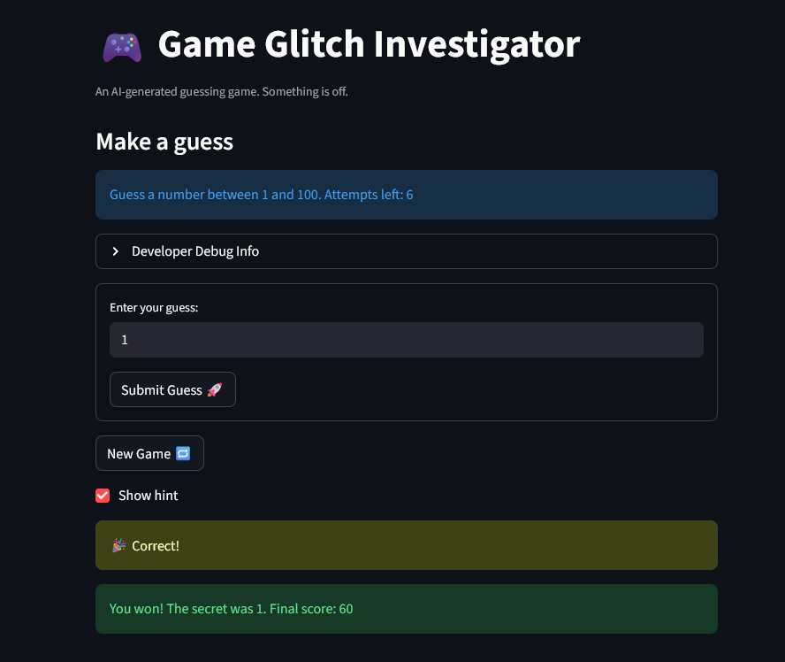
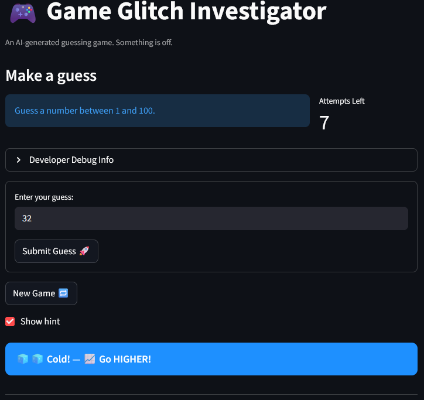

# 🎮 Game Glitch Investigator: The Impossible Guesser

## 🚨 The Situation

You asked an AI to build a simple "Number Guessing Game" using Streamlit.
It wrote the code, ran away, and now the game is unplayable. 

- You can't win.
- The hints lie to you.
- The secret number seems to have commitment issues.

## 🛠️ Setup

1. Install dependencies: `pip install -r requirements.txt`
2. Run the broken app: `python -m streamlit run app.py`

## 🕵️‍♂️ Your Mission

1. **Play the game.** Open the "Developer Debug Info" tab in the app to see the secret number. Try to win.
2. **Find the State Bug.** Why does the secret number change every time you click "Submit"? Ask ChatGPT: *"How do I keep a variable from resetting in Streamlit when I click a button?"*
3. **Fix the Logic.** The hints ("Higher/Lower") are wrong. Fix them.
4. **Refactor & Test.** - Move the logic into `logic_utils.py`.
   - Run `pytest` in your terminal.
   - Keep fixing until all tests pass!

## 📝 Document Your Experience

- Purpose: The purpose of the game is to guess a number, as you get closer to the number, you get Hotter, and Colder as you get further away to the number. You have 8 guesses to find the number, and each incorrect guess will deduct points.
- Bugs: The guess hint logic was reversed, so each guess would produce hints that took you further away from the correct answer, there was no boundary checking for input, as well as for the answer for different modes, and the new game button would not work
- Fixes: Fixes applied were the hint logic, boundary checking for the user inputs, as well as the storing of user inputs into the guess array in which caused hints to not appear, and the new game button not starting a new game.

## 📸 Demo

- 

## 🚀 Stretch Features

- 
